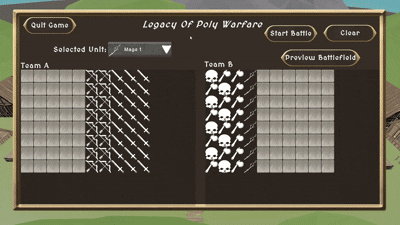

# Legacy of PolyWarfare 🎮⚔️

A tactical wargame featuring strategic unit placement, three distinct unit classes, and dynamic AI-driven combat. Build your army, command your forces, and lead your team to victory!

## 🎯 Overview

**Legacy of PolyWarfare** is a Unity-based tactical battle system where two teams face off on a procedurally-defined grid battlefield. Players deploy units strategically across their starting zone, then watch as AI-controlled units engage in real-time combat. The last team standing wins!



Download Link:
https://drive.google.com/file/d/18zzijx9X2Z4vCAREgNekqbD7pXUZ535P/view?usp=sharing

### Key Features
- 🏗️ **Custom Battle Editor** - Intuitive grid-based unit placement system
- 🤖 **Advanced AI System** - Intelligent enemy targeting and state management
- ⚔️ **Three Unit Classes** - Melee, Archer, and Mage with unique attack styles
- 🎵 **Dynamic Audio** - Background music and immersive sound effects
- 📊 **Real-time Combat Zone** - Live camera control during battles
- 🎭 **Battle Summary** - Detailed match results and victory conditions

---

## 🕹️ Unit Classes

### 1. **Melee Warriors** ⚔️
**Close-range specialists with high survivability**

- **Attack Range**: 2-3 meters
- **Damage**: 25-30 HP per hit
- **Mechanics**: Direct damage application through collision-based hitbox
- **Strategy**: Frontline positioning for maximum effectiveness
- **Advantages**: High damage output, fast attack cooldown
- **Disadvantages**: Must close distance to enemy

**Attack System**: `MeleeAttack.cs`
- Swing-based attack animation
- Hitbox activation during swing phase
- Automatic target validation (team check, alive check)

---

### 2. **Archers** 🏹
**Mid-range damage dealers with consistent accuracy**

- **Attack Range**: 8-10 meters
- **Damage**: 30 HP per shot
- **Projectile Speed**: 20 units/second
- **Mechanics**: Spawn projectiles that travel toward target
- **Strategy**: Mid-line positioning for optimal cover
- **Advantages**: Extended range, can engage from safer distance
- **Disadvantages**: Slower attack animation

**Attack System**: `RangedAttack.cs`
- Arrow spawning at bow tip
- Gravity-disabled ballistic trajectory
- Collision detection with auto-destruction on impact
- Passes through dead units without stopping

---

### 3. **Mages** ✨
**Area-of-effect specialists with crowd control**

- **Attack Range**: 8 meters
- **Damage**: 40 HP per spell (AoE effect)
- **Spell Radius**: 3-meter blast radius
- **Mechanics**: Cast spells that damage all enemies in radius
- **Strategy**: Rear positioning for maximum AoE coverage
- **Advantages**: Can hit multiple enemies at once
- **Disadvantages**: Highest cooldown, requires positioning

**Attack System**: `MagicAttack.cs`
- Spell particle effects during cast
- Area-of-effect damage application
- Automatic friendly-fire prevention
- Custom spell radius configuration

---

## 🎮 Game Mechanics

### Battle Editor System
The **Custom Battle Editor** (`BattleEditorManager.cs`) provides an intuitive interface for setting up matches:

#### Grid Placement
- **Team A Grid**: 8x8 cells (default, fully customizable)
- **Team B Grid**: 8x8 cells (default, fully customizable)
- **Bilinear Interpolation**: Smooth unit positioning across terrain
- **Corner-based Positioning**: Define grid corners for flexible battlefield layouts

#### Unit Library
- Add unlimited unit types to your arsenal
- Each unit has:
  - Unique prefab with components
  - Custom sprite icon for UI
  - Unit type classification (Melee/Archer/Mage)
  - Individual health and damage stats

#### Battle Modes
1. **Editor Mode**: Place units on grid, preview setup
2. **Preview Mode**: Camera control without combat
3. **Battle Mode**: Real-time combat with AI engagement

### AI Combat System

#### Unit Controller (`UnitController.cs`)
The intelligent AI system governs all unit behavior:

**State Machine**:
- **Idle State**: No target, waiting for enemies
- **Chase State**: Moving toward detected enemy
- **Attack State**: In range, engaging target

**Target Management**:
- Real-time closest enemy detection
- Automatic target refresh when current target dies
- Dynamic distance-based state transitions
- Collision avoidance to prevent unit stacking

**Detection Range**: Fully customizable (default: infinite)

#### Combat Resolution
1. **Damage Application**: Instant for Melee, projectile-based for Archer, AoE for Mage
2. **Team Validation**: Automatic friendly-fire prevention
3. **Death Checking**: Instant removal of dead units from combat
4. **Victory Detection**: Real-time team elimination tracking

### Damage System

#### Health Component (`Health.cs`)
Manages unit vitality and damage processing:

```
Maximum HP: 100 (customizable per unit)
Current HP: Tracks real-time health
Low Health Threshold: Visual indicator at 25% HP
```

**Damage Processing**:
- Queued damage system prevents multiple hits per frame
- Instant application with UI updates
- Death trigger animation
- Persistent corpses (optional auto-cleanup)

#### Hitbox System (`DamageHitbox.cs`)
Melee attack collision detection:

- **Layer Masking**: Target specific game object types
- **Swing Tracking**: Prevents multiple hits on same target per swing
- **Self-Damage Prevention**: Cannot damage own team or self
- **Dead Unit Bypass**: Projectiles pass through corpses

---

## 🎨 User Interface

### Custom Battle UI (`CustomBattleUIController.cs`)
**Unit Selection Dropdown**
- Visual unit icons
- Unit names
- Real-time dropdown updates

**Action Buttons**
- **Start Battle**: Launch match with current setup
- **Preview Battle**: Camera preview without combat
- **Clear Units**: Reset battlefield to empty state
- **Return to Editor**: Exit preview back to placement

### Grid Cell UI (`GridCellUI.cs`)
**Interactive Grid Cells**
- Click to place/remove units
- Visual feedback with unit icons
- Team-specific color coding
- Automatic icon updates

### Result Panel (`WarGameManager.cs`)
**Battle Summary**
- Victory announcements (Team A / Team B / Draw)
- Background music sync
- Battle statistics
- Return to Editor / Retry options

---

## 🔧 Technical Architecture

### Core Components

| Component | Purpose |
|-----------|---------|
| `WarGameManager.cs` | Battle orchestration, victory detection, audio management |
| `BattleEditorManager.cs` | Battle setup, unit placement, grid management |
| `UnitController.cs` | AI state machine, targeting, movement |
| `AttackSystem.cs` | Base attack class inherited by Melee/Archer/Mage |
| `Unit.cs` | Unit identity, team tracking, type classification |
| `Health.cs` | Damage processing, death handling, animations |
| `DamageHitbox.cs` | Collision detection for melee attacks |
| `Projectile.cs` | Arrow physics, collision handling |
| `Spell.cs` | AoE damage calculation, group targeting |

### Enum Definitions
```
Team: TeamA, TeamB
UnitType: Melee, Archer, Mage
AIState: Idle, Chase, Attack
```

---

## 🎵 Audio System

**AudioManager.cs** provides:
- Master volume control
- SFX playback with spatial audio
- Pitch randomization (walk sounds)
- Background music management

**Customizable Levels**:
- Music Volume: 0-100%
- SFX Volume: 0-100%
- Real-time adjustment during gameplay

---

## 🎮 How to Play

### Setup Battle
1. **Launch Editor**: Enter Custom Battle scene
2. **Select Unit**: Choose from unit dropdown
3. **Place Units**: Click grid cells to place/remove units
4. **Adjust Positions**: Reorganize as needed
5. **Preview** (Optional): Click "Preview Battle" to inspect setup

### Start Battle
1. **Click "Start Battle"**: Matches commence with selected units
2. **Watch Combat**: AI units engage automatically
3. **Camera Control**: Use WASD/Mouse to observe battle
4. **Victory Detection**: Game ends when one team eliminated

### Battle Modes
- **Real-time Combat**: AI makes targeting decisions
- **First-Person Camera**: Spectator view of battlefield
- **Victory Detection**: Automatic when one team reaches 0 units

---

## 📊 Battle Victory Conditions

**Team A Wins**: All Team B units defeated  
**Team B Wins**: All Team A units defeated  
**Draw**: Both teams eliminated simultaneously  

---

## ⚙️ Customization

### Unit-Level Customization
- Health values
- Attack damage
- Attack cooldown
- Attack range
- Movement speed
- Rotation speed

### Grid Customization
- Grid dimensions (rows/cols)
- Starting positions (corner references)
- Direction flipping (row/col orientation)
- Visual gizmo colors

### Audio/Visual Settings
- Background music clip
- Music volume level
- SFX volume level
- Spectator camera angles

---

## 🚀 Performance Optimizations

- **All Debug.Log statements removed** for optimized console output
- **Efficient AI targeting** with closest-enemy early exit
- **Projectile garbage collection** with auto-destroy
- **Collision avoidance** prevents unit stacking overhead
- **Rigidbody interpolation** for smooth movement

---

## 📋 Project Structure

```
Legacy of PolyWarfare/
├── Scripts/
│   ├── Attack Type/
│   │   ├── MeleeAttack.cs
│   │   ├── RangedAttack.cs
│   │   └── MagicAttack.cs
│   ├── Units Script/
│   │   ├── Unit.cs
│   │   ├── UnitController.cs
│   │   └── Health.cs
│   ├── Game Manager/
│   │   └── WarGameManager.cs
│   ├── UI/
│   │   ├── AudioManager.cs
│   │   └── Custom Battle/
│   │       ├── BattleEditorManager.cs
│   │       ├── CustomBattleUIController.cs
│   │       ├── GridCellUI.cs
│   │       └── TeamGridManager.cs
│   ├── Camera Controller/
│   │   ├── FirstPersonSpectatorController.cs
│   │   └── SpectatorControls.cs
│   └── Sword, Arrows & Projectile script/
│       ├── DamageHitbox.cs
│       ├── Projectile.cs
│       └── Spell.cs
└── README.md
```

---


## 🤝 Development Notes

- Built with **Unity** and **C#**
- Optimized for desktop platforms
- All debug logging removed for production
- Modular architecture for easy expansion
- Extensible unit class system

---

**Enjoy commanding your forces and achieving legendary victories!** ⚡🏆

*Last Updated: February 2026*
